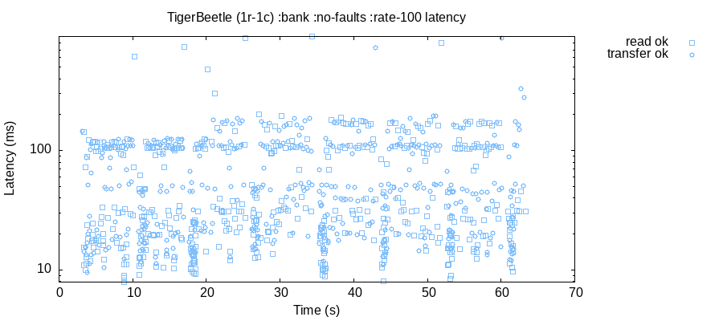
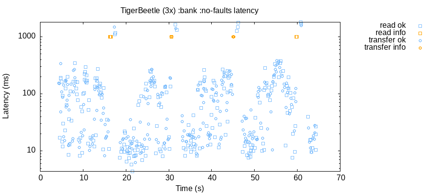

# `jepsen-tigerbeetle`

### A [Jepsen](https://github.com/jepsen-io/jepsen) Test for [TigerBeetle](https://github.com/tigerbeetledb/tigerbeetle).

## Why TigerBeetle?

- sound grounding in research
- test culture
- devs are helpful in the chat

## Why Jepsen?

TigerBeetle does [similar testing](https://github.com/tigerbeetledb/viewstamped-replication-made-famous) during development, so why try Jepsen?

Jepsen is [good](http://jepsen.io/analyses):

- real running clusters
- real environmental faults
- existing tests and models evolved by finding bugs and increasing understanding time and time again

My personal belief is that Jepsen's the map is not the territory and highly adapted property generators will find a bug. Even in a meaningfully tested system like TigerBeetle. I also think that it will be necessary to enhance the existing bank test to be most fruitful. Let's see what we can learn...

----

## Developing the Jepsen Test

`jepsen-tigerbeetle`:

- builds
  - [tigerbeetledb/tigerbeetle](https://github.com/tigerbeetledb/tigerbeetle) 
  - [tigerbeetledb/tigerbeetle-java](https://github.com/tigerbeetledb/tigerbeetle-java) (Jepsen is Clojure so uses Java client)
- can install/remove, setup/teardown, and start/stop arbitrary TigerBeetle replicas
- capture stdout/stderr, logs, and data files

----

### Bank Test

Uses Jepsen's [bank test](https://jepsen-io.github.io/jepsen/jepsen.tests.bank.html).

```clj
; sample bank client operations

:invoke	:transfer	{:from 2, :to 1, :amount 3}
:ok	:transfer	{:from 2, :to 1, :amount 3}
:invoke	:transfer	{:from 1, :to 2, :amount 2}
:ok	:transfer	{:from 1, :to 2, :amount 2}
:invoke	:read	nil
:ok	:read	{1 -3, 2 3}
```

Jepsen's bank `checker` insures:
  - all totals match
  - `:negative-balances?` is respected
  - stats and plots 

----
  
### Account Creation/Lookup

Treats TigerBeetle's immutable accounts, their creation, lookup, and ledgers as a grow only set.

Uses Jepsen's [set-full](https://jepsen-io.github.io/jepsen/jepsen.checker.html#var-set-full) checker.

The grow only set generates random operations of:
```clj
; sample set-full client operations

:invoke	:add [ledger account]
:ok	:add [ledger account]
:invoke	:read [ledger nil]
:ok	:read [ledger #{account account' ...}]
```

TigerBeetle [is designed](https://tigerbeetle.com/index.html#home_safety) for [strict serializability](http://jepsen.io/consistency/models/strict-serializable) so `:linearizable? true` is set for the checker. 

----

## Faults

- Partitioning

- Process kill, pause, and resume

- Packet corruption

- File corruption

----

## Current Status

### TigerBeetle is making good progress.

We can now run a straightforward relatively low rate test end-to-end.

Here's one replica with one client and no faults:



Increasing to 3 replicas and 3 clients periodically causes timeouts:



And in both cases the latency distribution is *very* patterned.  Maybe it means something? 🤔

### So we'll take a pause and check back when either we learn something new about the timeout behavior, or TigerBeetle development progresses...

----

### (P.S. It's premature to partition or introduce other faults. Doing so results in an un-runnable test.)
